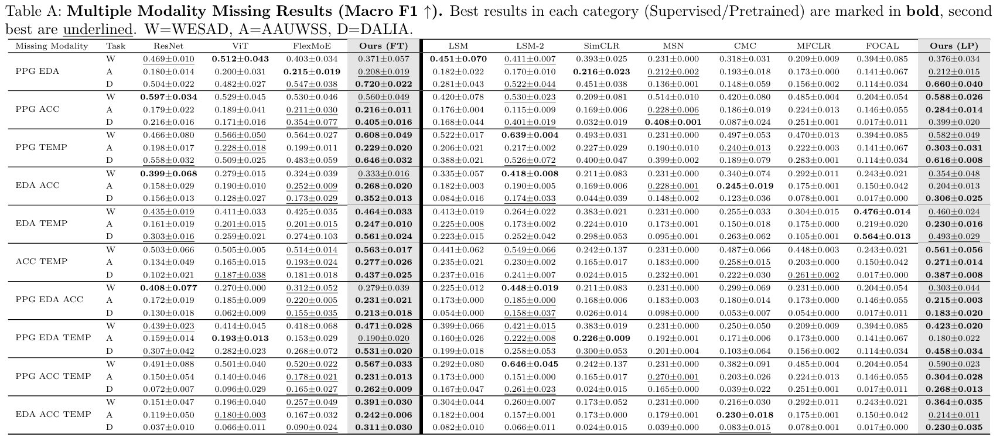
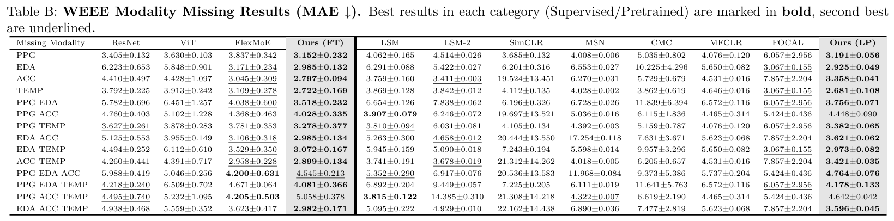
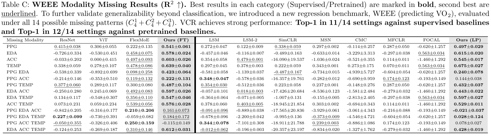
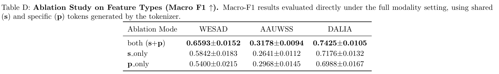
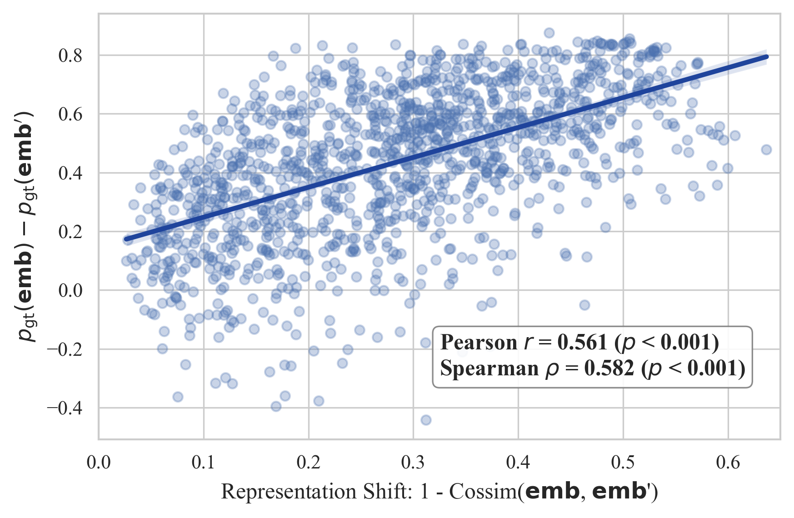

# Rebuttal_ICML2026-8291

**Figure A: Correlation between Representation Shift and Ground Truth Probability Drop.** The larger the discrepancy between **emb** and **emb'**, the greater the performance drop. This suggests that reconstructing an entire missing modality, including uninferable modality-specific details, can induce hallucination-like completions, leading to semantic inconsistency and directly harming performance.
